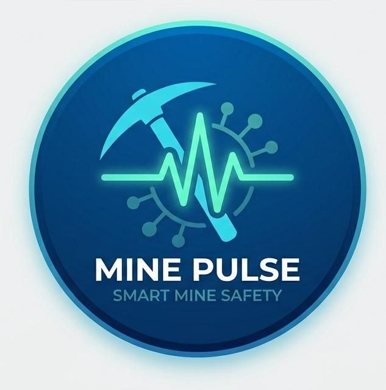
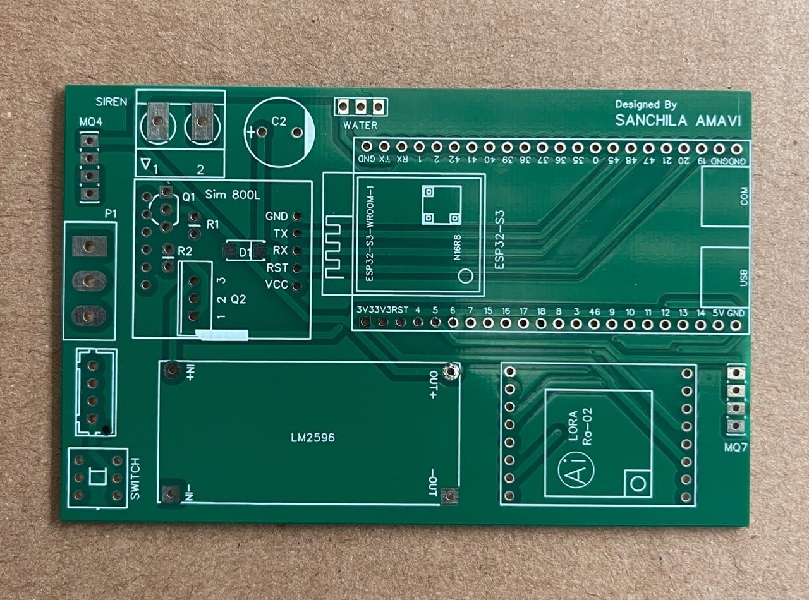
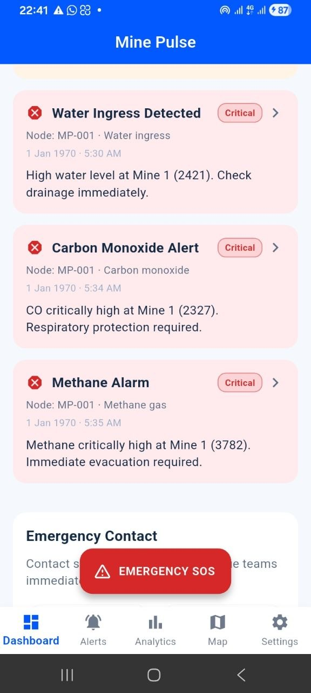
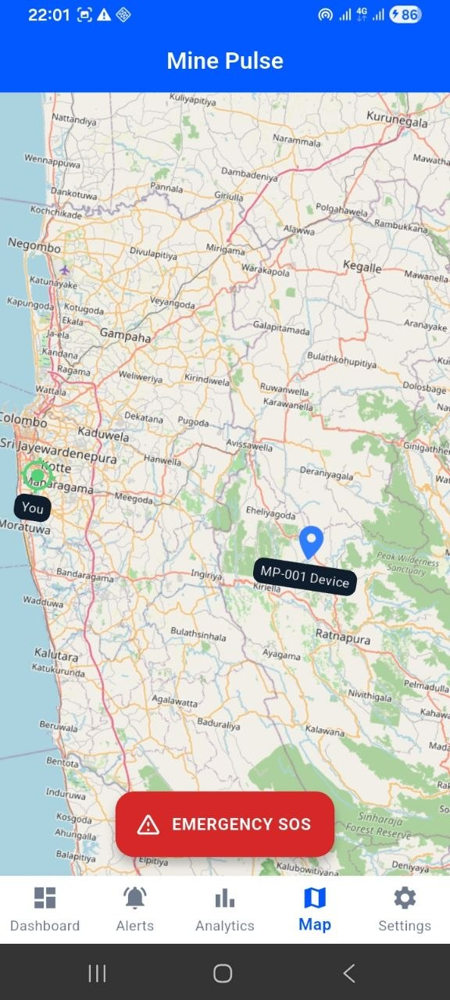

<div align="center">




<a href="https://sanchila-amavi.vercel.app/" target="_blank">
  
</a>

<br/>


<br/>


</div>

<br/>


## 🕳️ About The Project

> MinePulse (**SubterraGuard**) is a professional, end-to-end IoT mine safety solution engineered to protect underground miners with fast multi-gas hazard detection, instant local & cloud alerts, and polished cross-platform monitoring apps.

Two underground **ESP32‑S3** sensor nodes continuously measure **methane (MQ‑4)**, **carbon monoxide (MQ‑7)**, and **water level**. The moment any reading breaches a danger threshold, the node fires a **12V siren** and transmits a **LoRa 433 MHz** radio alert to the surface gateway — within milliseconds, with **zero cloud dependency underground**.

At the surface, the gateway decodes the alert, sounds a buzzer, displays hazard details on an **OLED screen**, dispatches an **SMS via SIM800L GSM**, and simultaneously uploads the event to **Firebase** — instantly pushing notifications to the **web dashboard** and **Flutter mobile app** used by supervisors anywhere on site.

<div align="center">
<table>
<tr>
<td align="center" width="20%"><h2>2</h2>Underground Nodes</td>
<td align="center" width="20%"><h2>CH₄ · CO</h2>Gas Sensors</td>
<td align="center" width="20%"><h2>5</h2>Alert Channels</td>
<td align="center" width="20%"><h2>433 MHz</h2>LoRa Frequency</td>
<td align="center" width="20%"><h2>Android · iOS · Web</h2>Platforms</td>
</tr>
</table>
</div>

<br/>

## 📚 Table of Contents

- [About The Project](#️-about-the-project)
- [Key Features](#-key-features)
- [System Architecture](#-system-architecture)
- [Gallery](#-gallery)
- [Hardware Design](#-hardware-design)
- [Tech Stack](#-tech-stack)
- [Cloud Data Structure](#️-cloud-data-structure)
- [Getting Started](#-getting-started)
- [Repository Structure](#-repository-structure)
- [Roadmap](#-roadmap)
- [Author](#-author)

<br/>

## ✨ Key Features

<table>
<tr>
<td width="50%">

### 📡 LoRa 433 MHz Long-Range Link
Reliable wireless bridge from underground nodes to the surface gateway — no WiFi or cellular infrastructure needed below ground.

</td>
<td width="50%">

### 🔥 Multi-Gas Hazard Detection
Simultaneous real-time sensing of methane (CH₄), carbon monoxide (CO), and water flooding at every node.

</td>
</tr>
<tr>
<td width="50%">

### 🚨 5-Channel Instant Alerts
**Siren · OLED · Buzzer · SMS · Firebase Push** — all triggered within seconds of any threshold breach.

</td>
<td width="50%">

### ☁️ Firebase Cloud Layer
Realtime Database logs every alert with full timestamps; Cloud Functions auto-dispatch FCM push notifications.

</td>
</tr>
<tr>
<td width="50%">

### 📱 Flutter Mobile App
Cross-platform Android/iOS app with live mine status, telemetry, alert history, and push notifications.

</td>
<td width="50%">

### 🌐 Web Dashboard
Browser-based supervisor dashboard with live mine status, alert history, and event timelines.

</td>
</tr>
<tr>
<td width="50%">

### 🔌 Custom PCB Design
Compact, field-deployable PCBs engineered for both underground nodes and the surface gateway.

</td>
<td width="50%">

### 🏗️ Multi-Node Scalability
One surface gateway can monitor multiple underground nodes — built to expand across adjacent mine shafts.

</td>
</tr>
</table>

<br/>


<details>
<summary>🔽 Flow Charts — Underground Node & Surface Gateway (click to expand)</summary>

<br/>

<table>
<tr>
<td align="center" width="50%"><br/><sub><b>🔽 underground flow chart</b><br/>Underground Node Logic</sub></td>
<td align="center" width="50%"><br/><sub><b>🔽 surface flow chart</b><br/>Surface Gateway Logic</sub></td>
</tr>
</table>

</details>

<br/>

## 🖼️ Gallery

<div align="center">

### 🔧 Hardware & Enclosures

<table>
<tr>
<td align="center" width="33%"><br/><sub><b>🖥️ pcb</b><br/>Custom PCB Layout</sub></td>
<td align="center" width="33%"><br/><sub><b>🖥️ assembled pcb</b><br/>Assembled PCB</sub></td>
<td align="center" width="33%"><br/><sub><b>🧪 working mine pulse</b><br/>Bench Testing</sub></td>
</tr>
<tr>
<td align="center"><br/><sub><b>📦 enclosure underground</b><br/>Underground Node Enclosure</sub></td>
<td align="center"><br/><sub><b>📦 enclosure surface</b><br/>Surface Gateway Enclosure</sub></td>
<td align="center"><br/><sub><b>📦 enclosure surface 1</b><br/>Enclosure — Alt View</sub></td>
</tr>
<tr>
<td align="center"><br/><sub><b>✅ final underground mine pulse</b><br/>Final Underground Node</sub></td>
<td align="center"><br/><sub><b>✅ final surface mine pulse</b><br/>Final Surface Gateway</sub></td>
<td align="center"><br/><sub><b>✅ final surface 1 mine pulse</b><br/>Surface Gateway — Alt View</sub></td>
</tr>
</table>

### 📱 Mobile App

<table>
<tr>
<td align="center" width="25%"><br/><sub><b>📱 minepulse mobile 1</b><br/>Live Alert Dashboard</sub></td>
<td align="center" width="25%"><br/><sub><b>📱 minepulse mobile3</b><br/>Mine Status View</sub></td>
<td align="center" width="25%"><br/><sub><b>📱 minepulsemobile4</b><br/>Alert History</sub></td>
<td align="center" width="25%"><br/><sub><b>📱 minepulsemobile5</b><br/>Location / Map View</sub></td>
</tr>
</table>

### 🌐 Web Dashboard

<table>
<tr>
<td align="center" width="50%"><br/><sub><b>🌐 web app mine pulse 1</b><br/>Supervisor Dashboard</sub></td>
<td align="center" width="50%"><br/><sub><b>🌐 webapp minepulse</b><br/>Analytics & Telemetry</sub></td>
</tr>
</table>

</div>

<br/>


## 🔩 Hardware Design

Both underground nodes and the surface gateway run on custom-designed PCBs built around the **ESP32-S3-N16R8** microcontroller paired with **LoRa Ra-02 SX1278 433 MHz** radio modules.

| Component | Underground Node | Surface Gateway |
|---|---|---|
| **MCU** | ESP32-S3-N16R8 | ESP32-S3-N16R8 |
| **Radio** | LoRa Ra-02 SX1278 (433 MHz) | LoRa Ra-02 SX1278 (433 MHz) |
| **Gas Sensors** | MQ-4 (Methane), MQ-7 (CO) | — |
| **Water Sensor** | ✅ | — |
| **Alarm** | 12V Siren (transistor–MOSFET driver) | Active Buzzer |
| **Display** | — | 1.3" SH1106 OLED |
| **Connectivity** | LoRa only (no cloud dependency) | WiFi + SIM800L GSM |
| **Power** | LM2596 / XL4015 Buck Converter, 12V supply | LM2596 / XL4015 Buck Converter, 12V supply |

<br/>

## 🛠️ Tech Stack

<div align="center">


</div>

<br/>

## ☁️ Cloud Data Structure

Firebase Realtime Database is organised for fast, real-time propagation to every connected client:

```
Firebase Realtime Database
 ├─ /status/mine1              → Live sensor readings, node 1
 ├─ /status/mine2              → Live sensor readings, node 2
 ├─ /alerts/mine1/latest       → Most recent hazard event, node 1
 ├─ /alerts/mine1/history      → Full alert history, node 1
 ├─ /alerts/mine2/latest       → Most recent hazard event, node 2
 └─ /alerts/mine2/history      → Full alert history, node 2
```

**Firebase Cloud Functions** automatically dispatch **FCM topic notifications** whenever a new alert record is written. The Flutter app subscribes to the `mine_alerts` topic for instant push alerts, while the web dashboard uses the Firebase JS SDK for live, real-time UI updates — deployed on **Firebase Hosting** for zero-infrastructure access.

<br/>

## 🚀 Getting Started

### Firebase Setup

```bash
# 1. Create a project at https://console.firebase.google.com/
# 2. Enable Realtime Database and choose a region
# 3. Start in test mode during development
# 4. Copy your database URL into firmware/surface_node.ino (FIREBASE_DB_URL)
# 5. Update web_dashboard/app.js with your Firebase config

npm install -g firebase-tools
firebase login
firebase init hosting
firebase deploy
```

### Firmware

Flash `firmware/underground_node` to each underground ESP32-S3, and `firmware/surface_node` to the gateway ESP32-S3, using PlatformIO or the Arduino IDE.

### Mobile App

```bash
cd flutter_app
flutter pub get
flutter run
```

<br/>

## 📁 Repository Structure

```
mine-safety-system/
├── firmware/           # ESP32-S3 firmware — underground & surface nodes
├── flutter_app/        # Flutter mobile app (Android/iOS)
├── web_dashboard/       # Browser dashboard + Firebase integration
├── cloud_functions/     # Firebase Cloud Functions (FCM dispatch)
├── functions/           # Additional backend functions
├── assets/              # Logo, diagrams, and gallery images
├── firestore.rules      # Firestore security rules
├── firebase.json         # Firebase project configuration
└── README.md
```

<br/>

## 🗺️ Roadmap

- [x] Underground gas & water hazard detection
- [x] LoRa node-to-gateway communication
- [x] Firebase real-time cloud sync
- [x] Flutter mobile app with push alerts
- [x] Web supervisor dashboard
- [ ] Multi-mine fleet dashboard (3+ shafts)
- [ ] Solar-powered underground node variant
- [ ] Predictive hazard analytics (ML)

<br/>


</div>

<br/>

<div align="center">


*"Saving miners with intelligent underground hazard alerts and cloud monitoring."*

</div>
